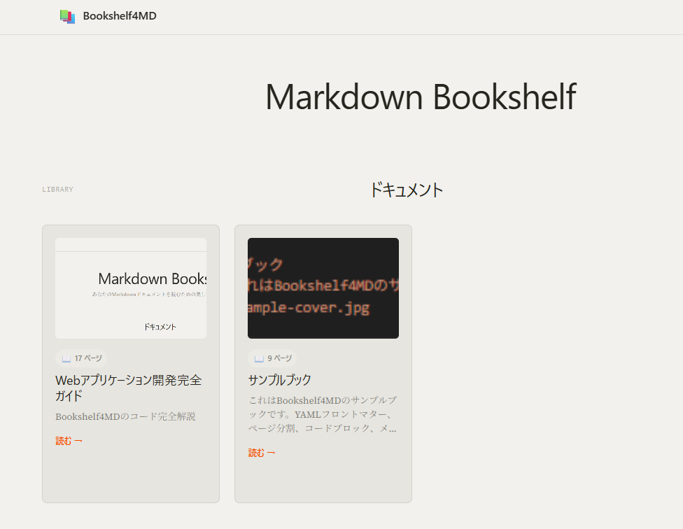

# Bookshelf4MD

Markdownファイルを「本棚」のように閲覧できるWebアプリケーションです。温かみのあるミニマルデザインで、美しくMarkdownコンテンツを表示します。

## 特徴

- **📚 本棚風表示**: 本棚のようなカード表示、ホバーで浮き上がるエフェクト
- **📋 リスト表示**: シンプルなリスト形式での一覧表示
- **🔄 表示切替**: 本棚風とリスト表示をワンクリックで切り替え
- **📖 サイドバー目次**: 左側に目次を表示、クリックで章に移動
- **📊 進捗表示**: 右上に読書進捗（パーセンテージとプログレスバー）
- **📖 ページ分割**: `##`見出しで自動的にページを分割
- **📋 ワンクリックコピー**: コードブロックをワンクリックでコピー
- **🖼️ メディア対応**: 画像・動画・埋め込み動画の表示
- **⌨️ キーボード操作**: 矢印キーでページナビゲーション
- **📱 レスポンシブ**: モバイル・タブレット対応

## インストール

### 要件

- Python 3.8以上
- pip

### セットアップ

1. リポジトリをクローン

```bash
git clone <repository-url>
cd bookshelf4md
```

2. 仮想環境を作成

```bash
python -m venv .venv
```

3. 仮想環境をアクティベート

**Windows:**
```bash
.venv\Scripts\activate
```

**Mac/Linux:**
```bash
source .venv/bin/activate
```

4. パッケージをインストール

```bash
pip install -r requirements.txt
```

## 使い方

### アプリケーションを起動

**Windows (start.batを使用):**
```bash
start.bat
```

**コマンドラインから起動:**
```bash
flask run
```

または

```bash
python app.py
```

ブラウザで `http://localhost:5000` にアクセスしてください。

### Markdownファイルを追加

`mds/`フォルダに`.md`ファイルを配置してください。

### メディアファイル

各ブックごとにメディアフォルダを作成できます：

- `mds/media_[ブック名]/` に画像・動画を配置
- パス指定: `/media_[ブック名]/image.png`

```markdown

```

### 表示モードの切り替え

ブック一覧画面で以下の2つの表示モードを切り替えられます：

- **本棚風**: カード形式で表示、ホバーで本が浮き上がり、詳細情報が表示される
- **リスト**: シンプルなテーブル形式で一覧表示

画面右上の切り替えボタンで表示を変更できます。

## Markdown記法

### YAMLフロントマター

Markdownファイルの冒頭にYAMLフロントマターを記述すると、ブック一覧でタイトル、説明、カバー画像が表示されます。

```yaml
---
title: ブックタイトル
description: これは本の説明文です。一覧画面で表示されます。
cover: /media_sample-book/cover.png
---
```

### ページ分割

`##`見出しでページが分割されます。

```markdown
この部分は「はじめに」ページとして表示されます。

## 第1章

1ページ目のコンテンツ

## 第2章

2ページ目のコンテンツ
```

### コードブロック

コードブロックは自動的にシンタックスハイライトされ、コピー機能が付きます。

````markdown
```python
def hello():
    print("Hello, World!")
```
````

### 画像

```markdown

```

### 動画

**ローカル動画:**
```markdown
<video width="640" height="360" controls>
    <source src="/media_sample-book/video.mp4" type="video/mp4">
</video>
```

**YouTube埋め込み:**
```markdown
<iframe width="640" height="360"
        src="https://www.youtube.com/embed/VIDEO_ID"
        title="説明"
        frameborder="0"
        allowfullscreen>
</iframe>
```

## プロジェクト構造

```
bookshelf4md/
├── app.py                      # Flaskアプリケーション
├── config.py                   # 設定ファイル
├── start.bat                   # Windows起動スクリプト
├── requirements.txt            # Pythonパッケージ
├── README.md                   # このファイル
├── CLAUDE.md                   # Claude Code用プロジェクトガイド
├── LICENSE                     # ライセンス
├── deploy/
│   └── nginx.conf             # nginx設定例（本番環境用）
├── skilld-for-claude/          # Claude Code用スキル
│   ├── SKILL.md               # スキル定義
│   ├── references/
│   │   └── AI_GUIDELINE.md    # ドキュメント作成ガイドライン
│   └── scripts/
│       └── checker.py         # 形式チェックツール
├── static/
│   ├── css/
│   │   └── styles.css         # メインスタイルシート
│   ├── js/
│   │   └── main.js            # インタラクティブ機能
│   └── media/                 # デフォルトメディアファイル
├── templates/                  # HTMLテンプレート
│   ├── base.html              # ベーステンテプレート
│   ├── index.html             # ブック一覧
│   ├── book.html              # ブック閲覧
│   ├── 404.html               # 404エラーページ
│   ├── 500.html               # 500エラーページ
│   └── components/            # UIコンポーネント
│       ├── code_block.html
│       ├── footer.html
│       ├── header.html
│       ├── progress_bar.html
│       └── sidebar_toc.html
├── utils/                      # ユーティリティモジュール
│   ├── __init__.py
│   ├── frontmatter_parser.py  # YAMLフロントマター解析
│   ├── markdown_parser.py     # Markdown→HTML変換
│   └── page_splitter.py       # ページ分割ロジック
└── mds/                        # Markdownファイル格納
    ├── sample-book.md         # サンプルブック
    ├── web-app-development-complete-guide.md
    ├── media_sample-book/     # サンプルブック用メディア
    └── media_web-app-development-complete-guide/
```

## デザインシステム

このプロジェクトはCursorエディタ風のデザインシステムを採用しています。

- **温かみのある配色**: クリーム色の背景（#f2f1ed）
- **オレンジアクセント**: ブランドカラー（#f54e00）
- **3つのフォント**: 見出し（ゴシック）、本文（セリフ）、コード（モノスペース）

### 主要なカラートークン

```css
--cursor-dark: #26251e;    /* テキスト、見出し */
--cursor-cream: #f2f1ed;   /* ページ背景 */
--cursor-light: #e6e5e0;   /* カード背景、ボタン */
--accent: #f54e00;         /* アクセント、リンク */
--error: #cf2d56;          /* エラー、ホバー状態 */
--success: #1f8a65;        /* 成功状態 */
```

## キーボードショートカット

| キー | アクション |
|------|-----------|
| ← | 前のページ |
| → | 次のページ |

## ブック閲覧機能

### サイドバー目次

ブック閲覧画面の左側にサイドバーが表示されます。

- **目次自動生成**: `##`見出しをもとに目次を自動生成
- **クリックで移動**: 目次の項目をクリックすると該当ページに移動
- **現在位置ハイライト**: 読んでいるページがハイライト表示
- **モバイル対応**: トグルボタンで開閉

### 進捗表示

画面右上に読書の進捗が表示されます。

- **パーセンテージ**: 全体の何％を読んでいるかを表示
- **プログレスバー**: 視覚的な進捗表示
- **ページ数**: 現在のページ / 総ページ数

## 本番環境での運用 (nginx + Gunicorn)

**推奨構成:**
```
nginx (リバースプロキシ) → Gunicorn (WSGIサーバー) → Flaskアプリ
```

**Gunicornインストール:**
```bash
pip install gunicorn
```

**Gunicorn起動コマンド:**
```bash
gunicorn -w 4 -b 127.0.0.1:5000 app:app
```

**nginx設定例:**
`deploy/nginx.conf` を参照してください。

## Claude Code スキル

このプロジェクトには、Claude CodeでBookshelf4MD形式のドキュメントを作成するためのスキルが含まれています。

- **スキル名**: `bookshelf4md-author`
- **機能**: Bookshelf4MD形式の教科書・勉強教材Markdownドキュメント作成
- **使用方法**: Claude Codeで「〜の教科書を作って」「〜の教材を書いて」などと依頼

詳細は `skilld-for-claude/SKILL.md` をご覧ください。

## ライセンス

MIT License

## 作者

ryochinbo

---


